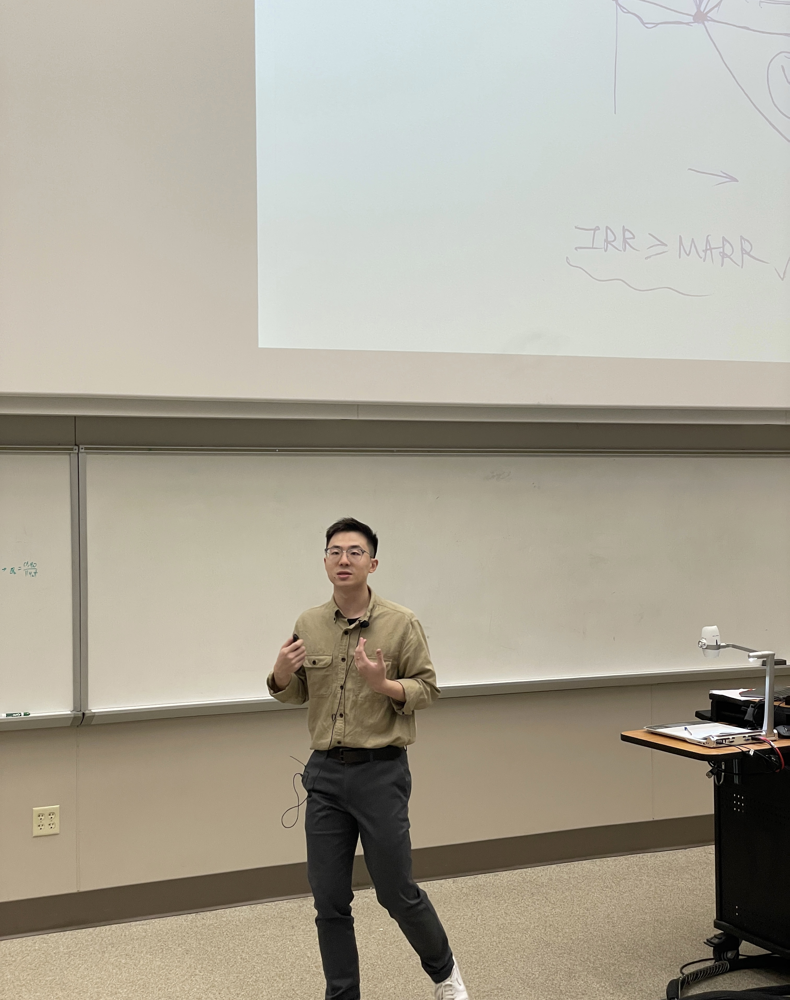

Growing up in a family of teachers, I bring a strong and distinctive record of teaching and educational innovation during my PhD journey. In particular, I have extensive experience in *IE343 — Engineering Economics*, serving in both lecturing and teaching assistant roles across **ten** semesters as of Fall 2025.

## Instructor

### IE343 Engineering Economics, Purdue University, Fall 2023
- Enrollment: **150** undergraduate students from 10 different engineering disciplines
- Overall evaluation score: 4.5/5.0
- Fully responsible for the class, and supervised two teaching assistants and two graders.
- [[Syllabus]](../pdf/IE343_syllabus_ZY.pdf)
  
 
